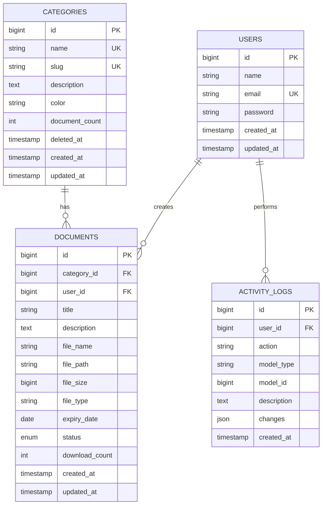

# 📁 SIADIL - Sistem Informasi Arsip Digital


**SIADIL** adalah aplikasi web untuk manajemen arsip digital yang memudahkan Anda dalam menyimpan, mengelola, dan mencari dokumen secara terorganisir.

## 🎯 Tentang Aplikasi

Aplikasi ini dirancang untuk membantu mengelola dokumen-dokumen penting dengan sistem kategorisasi, pencarian cepat, notifikasi, dan monitoring sistem.

## ✨ Fitur Utama

- 🔐 **Authentication** - Login & Register dengan Laravel Breeze
- 📊 **Dashboard** - Statistik dan ringkasan data secara real-time
- 📂 **Manajemen Kategori** - Organisasi dokumen dengan kategori & color coding
- 📄 **Manajemen Dokumen** - CRUD lengkap dengan upload file (PDF, DOCX, XLSX, PPTX, Images)
- 🔢 **Auto Document Number** - Nomor dokumen otomatis berdasarkan kategori (SM/2026/02/0001)
- 👁️ **File Preview** - Preview langsung untuk PDF dan gambar (JPG, PNG, GIF)
- 🔍 **Search & Filter** - Pencarian cepat berdasarkan judul, kategori, status
- 📋 **Activity Logs** - Tracking semua aktivitas sistem
- 💬 **Flash Messages** - Notifikasi success/error saat tambah/edit/hapus data

## 🛠️ Stack Teknologi

- **Framework**: Laravel 11.x
- **Authentication**: Laravel Breeze
- **Database**: MySQL / SQLite
- **Frontend**: Blade Templating dengan Custom CSS
- **Build Tool**: Vite
- **Storage**: Laravel Filesystem

## 🚀 Instalasi & Setup

### Prerequisites

- PHP 8.2 atau lebih tinggi
- Composer
- MySQL atau SQLite
- Node.js & NPM

### Langkah Instalasi

1. **Clone repository**
   ```bash
   git clone <repository-url>
   cd siadil
   ```

2. **Install dependencies**
   ```bash
   composer install
   npm install
   ```

3. **Setup environment**
   ```bash
   cp .env.example .env
   php artisan key:generate
   ```

4. **Setup database**
   
   Edit `.env` dan sesuaikan konfigurasi database:
   ```
   DB_CONNECTION=mysql
   DB_HOST=127.0.0.1
   DB_PORT=3306
   DB_DATABASE=siadil
   DB_USERNAME=root
   DB_PASSWORD=
   ```

5. **Run migrations & seed database**
   ```bash
   php artisan migrate:fresh --seed
   ```

6. **Build assets**
   ```bash
   npm run build
   ```

7. **Create storage link**
   ```bash
   php artisan storage:link
   ```

8. **Run development server**
   ```bash
   php artisan serve
   ```

9. **Akses aplikasi**
   
   Buka browser dan akses: `http://127.0.0.1:8000`
   
   Register akun baru untuk mulai menggunakan aplikasi.

## 📖 Cara Menggunakan

### Login & Register
- Klik **Register** untuk membuat akun baru
- Isi nama, email, dan password
- Setelah register, login dengan kredensial Anda

### Dashboard
- Halaman utama menampilkan statistik: total dokumen, dokumen aktif, jumlah kategori, dan total ukuran file
- Melihat dokumen terbaru, distribusi dokumen per kategori, dan aktivitas terbaru
- Quick navigation ke semua fitur

### Manajemen Kategori
- Klik **Kategori** di sidebar
- **Tambah Kategori**: Klik tombol "Tambah Kategori", isi nama, deskripsi, dan pilih warna
- **Edit/Hapus**: Klik tombol aksi pada setiap kategori
- Kategori yang dihapus masih bisa di-restore (Soft Delete)

### Manajemen Dokumen
- Klik **Dokumen** di sidebar
- **Tambah Dokumen**: Klik "Tambah Dokumen", isi informasi dan upload file (max 10MB)
- **Auto Numbering**: Nomor dokumen otomatis berdasarkan kategori dipilih
  - Format: `KODE_KATEGORI/YYYY/MM/XXXX`
  - Contoh: `SM/2026/02/0001` untuk Surat Masuk
  - Mapping otomatis: Surat Masuk→SM, Surat Keluar→SK, Invoice→INV, Kontrak→KTR, Laporan→LPR, Sertifikat→SRT
- **Search**: Gunakan search box untuk mencari berdasarkan judul dokumen
- **Filter**: Filter berdasarkan kategori atau status (Aktif/Arsip/Kadaluarsa)
- **Sort**: Urutkan berdasarkan tanggal, judul, atau ukuran file
- **Download**: Klik tombol download pada detail dokumen
- **Preview**: Lihat preview untuk PDF dan gambar (JPG, PNG, GIF)
  - File office (DOCX, XLSX, PPTX) tidak ada preview, silakan download untuk melihat

### Activity Logs
- Lihat semua aktivitas sistem (create, update, delete)
- Filter berdasarkan jenis aktivitas atau tanggal
- Export logs ke format CSV
- Cleanup logs lama untuk menghemat space

## 📋 Implementasi KUK BNSP (Ringkasan)

| KUK | Kategori | File/Folder Utama | Penjelasan Singkat |
|-----|----------|-------------------|-------------------|
| **001** | Analisis Tools | `composer.json`, `package.json` | Laravel 11 + Vite untuk development modern |
| **003** | Framework | `app/`, `config/app.php` | MVC Pattern dengan Laravel framework |
| **006** | UX Design | `resources/views/layouts/` | Clean UI, gradient colors, responsive design |
| **017** | Terstruktur | `routes/web.php`, `Controllers/` | Structured MVC: Routes → Controllers → Views |
| **018** | OOP | `app/Models/` | Eloquent Models dengan relationships & methods |
| **019** | Library PHP | `composer.json` | Laravel Breeze, Carbon, Faker, PHPUnit |
| **020** | SQL | Models (scopes, queries) | Optimized queries dengan WHERE, JOIN, ORDER BY |
| **021** | Akses DB | `app/Models/*.php` | Eloquent ORM untuk CRUD operations |
| **022** | Algoritma | `Document.php` | Search algorithm, file size formatting, date calculation |
| **024** | Migrasi DB | `database/migrations/` | Version control database dengan migrations |
| **025** | Debugging | Controllers (try-catch) | Error handling di semua CRUD operations |
| **030** | Multimedia | `DocumentController.php` | Upload file (PDF, DOC, XLS, images), preview & download |
| **032** | Code Review | All Controllers & Models | Comments & documentation di semua files |
| **036** | Pengujian | `tests/`, `phpunit.xml` | Testing framework setup (basic) |
| **044** | Alert/Notif | `layouts/main.blade.php` | Flash messages (success/error/info) dengan auto-hide |
| **047** | Pembaruan PL | `Category.php` (SoftDeletes) | Soft delete untuk data recovery |

### Contoh Code Implementasi KUK:

**KUK 018 (OOP) - Relationships:**
```php
// app/Models/Document.php
class Document extends Model {
    public function category() {
        return $this->belongsTo(Category::class);
    }
    public function user() {
        return $this->belongsTo(User::class);
    }
}
```

**KUK 022 (Algoritma) - Date Calculation:**
```php
// Hitung hari tersisa sampai expired
$daysUntil = (int) ceil(now()->diffInDays($document->expiry_date, false));
```

**KUK 025 (Debugging) - Error Handling:**
```php
try {
    $document = Document::create($validated);
    return redirect()->route('documents.index')->with('success', 'Document created!');
} catch (\Exception $e) {
    return redirect()->back()->with('error', 'Failed: ' . $e->getMessage());
}
```

## 🗄️ Database Structure & ERD

### Entity Relationship Diagram



### Penjelasan Relasi:

1. **Users → Documents (One to Many)**
   - 1 User bisa create banyak Documents
   - `documents.user_id` → `users.id`
   - Implementasi: `Document::belongsTo(User::class)` & `User::hasMany(Document::class)`

2. **Categories → Documents (One to Many)**
   - 1 Category bisa memiliki banyak Documents
   - `documents.category_id` → `categories.id`
   - Implementasi: `Document::belongsTo(Category::class)` & `Category::hasMany(Document::class)`

3. **Users → Activity Logs (One to Many)**
   - 1 User bisa melakukan banyak Activities
   - `activity_logs.user_id` → `users.id`
   - Implementasi: `ActivityLog::belongsTo(User::class)` & `User::hasMany(ActivityLog::class)`

### Cardinality:
- **1:N (One to Many)** → Relasi utama aplikasi
- **Soft Delete** → Categories bisa di-restore (kolom `deleted_at`)
- **Enum Status** → Documents: 'active', 'archived', 'expired'

### Query dengan Join:
```php
// Get documents dengan category & user info
Document::with(['category', 'user'])
    ->where('status', 'active')
    ->orderBy('created_at', 'desc')
    ->get();
```

## 🏗️ Tahapan Pembuatan Aplikasi (Ringkasan)

### FASE 1: Setup & Database (Hari 1-2)
```bash
# 1. Install Laravel & Breeze
composer create-project laravel/laravel siadil
composer require laravel/breeze --dev
php artisan breeze:install blade
npm install

# 2. Buat Migrations & Models
php artisan make:migration create_categories_table
php artisan make:migration create_documents_table
php artisan make:migration create_activity_logs_table
php artisan make:model Category
php artisan make:model Document
php artisan make:model ActivityLog
```

**KUK:** 001 (Tools), 003 (Framework), 021 (Akses DB), 024 (Migrasi)

### FASE 2: Backend Development (Hari 2-3)
```bash
# 3. Buat Controllers
php artisan make:controller CategoryController --resource
php artisan make:controller DocumentController --resource
php artisan make:controller DashboardController
php artisan make:controller LogController
```

**Implementasi:**
- Setup routes di `routes/web.php` (resource routes + custom routes)
- CRUD operations dengan validation & error handling
- File upload system (max 10MB, validation)
- Search & filter dengan query scopes

**KUK:** 017 (Terstruktur), 018 (OOP), 025 (Debugging), 030 (Multimedia)

### FASE 3: Frontend Development (Hari 3-5)
**Buat Views:**
- Layouts: `main.blade.php` (dengan sidebar), `guest.blade.php`
- Views: dashboard, categories (CRUD), documents (CRUD), logs
- Styling: Inline CSS dengan gradient colors, card layouts
- Flash messages: Auto-hide notifications (5 detik)

**KUK:** 006 (UX Design), 044 (Alert/Notif)

### FASE 4: Polish & Testing (Hari 5-6)
- Dashboard statistics (aggregate queries)
- Activity logging otomatis
- Document expiry check algorithm
- Testing & debugging semua fitur
- Code review & documentation

**KUK:** 020 (SQL), 022 (Algoritma), 025 (Debugging), 032 (Code Review), 036 (Pengujian)

### FASE 5: Deployment (Hari 7)
```bash
# Build & optimize
npm run build
php artisan migrate:fresh --seed
php artisan storage:link
php artisan config:cache
php artisan route:cache
```

## 🎤 Checklist Presentasi

### Persiapan Demo:
- [ ] Server running (`php artisan serve`)
- [ ] Database sudah di-seed
- [ ] Buka localhost:8000 di browser
- [ ] Siapkan code editor untuk show code

### Flow Presentasi (30-40 menit):

**1. Intro (3 menit)**
- Aplikasi: SIADIL - Sistem Arsip Digital
- Stack: Laravel 11 + Breeze + MySQL + Vite

**2. Demo Live (10 menit)**
- Register → Login
- Dashboard (statistik)
- CRUD Categories
- CRUD Documents (upload, preview, download)
- Activity Logs
- Flash messages

**3. KUK Implementation (15 menit)**
- Buka [README.md](README.md) → tunjukkan tabel KUK
- Pilih 5-7 KUK penting untuk dijelaskan:
  - **003 (Framework):** Show struktur folder `app/`, explain MVC
  - **018 (OOP):** Buka `Document.php`, show relationships
  - **024 (Migrasi):** Show `database/migrations/`, explain version control
  - **030 (Multimedia):** Show `DocumentController@store`, explain file upload
  - **044 (Alert/Notif):** Show flash messages di `main.blade.php`

**4. Database & ERD (5 menit)**
- Show ERD diagram di README
- Jelaskan 3 relasi utama (Users-Documents, Categories-Documents, Users-Logs)
- Buka database migrations untuk show struktur

**5. Q&A (7 menit)**

### Pertanyaan yang Sering Ditanya:

**Q: Kenapa pilih Laravel?**  
A: MVC pattern, Eloquent ORM, security built-in, ecosystem besar, development cepat.

**Q: Jelaskan MVC pattern?**  
A: Model (data/business logic), View (tampilan), Controller (routing/logic). Contoh: `Document.php` (Model) → `DocumentController.php` → `documents/index.blade.php` (View).

**Q: Bagaimana cara auto-generate document number?**  
A:
1. Ambil kategori yang dipilih user
2. Generate kode kategori (ada mapping untuk 6 kategori umum + fallback 3 huruf pertama)
3. Format: `KODE/TAHUN/BULAN/URUTAN` (contoh: SM/2026/02/0001)
4. Auto-increment per kategori per bulan (reset setiap bulan baru)

**Q: Bagaimana handle file upload?**  
A: 
1. Validation (type: PDF/DOC/XLS/PPTX/images, max: 10MB)
2. Store dengan Laravel Storage: `$request->file('file')->store('documents', 'public')`
3. Save metadata ke database (file_name, size, type, path)
4. Preview: Hanya PDF (iframe) dan Images (img tag)

**Q: Security di aplikasi?**  
A: 
- Laravel Breeze authentication
- CSRF protection automatic
- Eloquent ORM (SQL injection prevention)
- File validation (type & size)
- Auth middleware di routes

**Q: Explain soft delete?**  
A: Data tidak dihapus permanent, hanya tambah `deleted_at` timestamp. Bisa di-restore kapan saja dengan `$category->restore()`.

### Tips Saat Demo:
1. **Jangan buru-buru** - Jelaskan setiap fitur dengan jelas
2. **Show code** - Buka editor, tunjukkan file-file penting
3. **Explain konsep** - Jangan hanya show UI, jelaskan teknikal
4. **Antisipasi error** - Siapkan backup jika ada masalah
5. **Confident** - Kamu yang buat, kamu yang paling tahu!

## 📝 Sample Data (Seeder)

⚠️ **Database seeder sengaja dikosongkan untuk demo presentasi.**

**Untuk presentasi:**
- Database fresh (kosong)
- Tidak ada sample data
- Anda akan menambahkan data secara live saat presentasi

**Jika ingin sample data untuk testing, uncomment code di:**
- `database/seeders/DatabaseSeeder.php`
- Jalankan: `php artisan migrate:fresh --seed`

## 🔒 Security Features

- ✅ Laravel Breeze authentication
- ✅ CSRF Protection (automatic)
- ✅ SQL Injection prevention (Eloquent ORM)
- ✅ XSS Protection (Blade templating)
- ✅ File upload validation (type, size max 10MB)
- ✅ Auth middleware protection

## 🎨 Flash Messages (KUK 044)

Setiap operasi CRUD menampilkan notifikasi:
- ✅ **Success (Green)** - Operasi berhasil
- ❌ **Error (Red)** - Terjadi kesalahan
- ℹ️ **Info (Blue)** - Informasi umum

Auto-hide setelah **5 detik** dengan smooth animation.

---

**SIADIL v1.0** - Sistem Informasi Arsip Digital  
**Framework:** Laravel 11.x | **License:** MIT | **Year:** 2026
